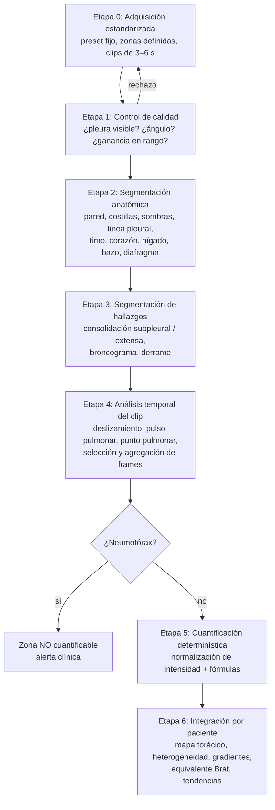

# qLUS-Neo — Propuesta técnica para un LUS score neonatal totalmente cuantitativo

> Documento de diseño. Estado: propuesta inicial (septiembre 2026).
> Objetivo: pasar de un score visual semicuantitativo (0–3 por zona, 0–18 total en el esquema de Brat)
> a una medición continua, reproducible e independiente del observador, de la **pérdida de aireación
> pulmonar** en ecografía pulmonar neonatal.

---

## 1. La premisa física: qué mide realmente el "blanco"

La intuición "más blanco = más líquido, más negro = más aire" es correcta **dentro de un rango**, pero
tiene tres límites que el algoritmo debe resolver explícitamente:

1. **El pulmón no se "ve"; se ven artefactos.** El pulmón aireado refleja casi todo el ultrasonido en la
   pleura y genera líneas A (reverberaciones horizontales). A medida que baja la fracción de aire
   (líquido, colapso alveolar, inflamación, fibrosis) aparecen líneas B verticales que, al confluir,
   producen el "pulmón blanco". Por lo tanto el blanco mide **pérdida de aire / aumento de densidad**,
   no agua específicamente. En TTN es mayormente agua; en SDR es sobre todo colapso alveolar por
   déficit de surfactante; en DBP hay componente fibrótico. Propuesta de nombre honesto para la
   salida: **Índice de Pérdida de Aireación (IPA)**, con "% de blanco" como uno de sus componentes.

2. **La relación brillo–aire no es monótona.** El continuo de densidad es:

   | Estado | Aire | Aspecto en la imagen | ¿Qué haría un "contador de blancos" ingenuo? |
   |---|---|---|---|
   | Normal | Alto | Negro con líneas A horizontales | Bien (bajo) |
   | Síndrome intersticial | ↓ | Líneas B separadas | Bien (intermedio) |
   | Pulmón blanco | ↓↓ | Líneas B confluentes | Bien (alto) |
   | **Consolidación / atelectasia** | ~0 | **Gris tisular** (tipo hígado), broncograma | **Mal: lo leería como "menos blanco" que el pulmón blanco** |
   | **Derrame pleural** | — | **Negro anecoico** | **Mal: lo leería como "aire"** |
   | **Neumotórax** | Aire fuera del pulmón | Líneas A, sin deslizamiento | **Mal: idéntico a "normal" en imagen estática** |

   Conclusión de diseño: **primero clasificar cada píxel (qué es), después medir (cuánto)**.

3. **El brillo depende del equipo y de la configuración.** Ganancia, TGC, profundidad, foco,
   frecuencia, rango dinámico, imagen armónica, compounding, filtros de speckle, persistencia, presión
   y ángulo de la sonda cambian los niveles de gris y la visibilidad de las líneas B. Un "% de blanco"
   solo es comparable si la adquisición está estandarizada y la intensidad está **calibrada**.

---

## 2. Arquitectura del sistema



Principio rector: **la IA decide QUÉ es cada píxel; una matemática explícita y auditable decide
CUÁNTO**. Esto hace el resultado explicable, permite auditar cada número y facilita la vía regulatoria.

### Etapa 0 — Adquisición estandarizada (sin esto nada es cuantitativo)

- **Preset "LUS-Neo-Q" bloqueado** en cada equipo: sonda lineal de alta frecuencia (o "hockey stick"
  en prematuros extremos), profundidad fija, un foco a nivel pleural, ganancia y TGC fijos,
  **armónicas, compounding, reducción de speckle y persistencia desactivados**, sin autooptimización.
- **Zonas**: las 6 de Brat (anterior superior, anterior inferior y lateral, por lado) como núcleo
  obligatorio; opcional protocolo extendido con zonas posteriores (10–12 zonas) para capturar el
  pulmón dependiente.
- **Clips de video (3–6 s)**, no fotos: con FR neonatal de 40–60/min se capturan varios ciclos, y el
  neumotórax solo se detecta en movimiento.
- **Vista**: definir una sola vista por zona (p. ej., longitudinal perpendicular a las costillas con
  "signo del murciélago", o transversal intercostal que evita las sombras costales). Mezclar vistas
  introduce varianza.
- **Formato**: DICOM sin compresión con pérdida (el JPEG altera los grises), sin calipers ni texto
  sobre la imagen. Registrar equipo, sonda, preset, soporte ventilatorio, FiO2, SpO2, posición y edad
  gestacional/posnatal.

### Etapa 1 — Control de calidad en tiempo real

Clasificador (ligero) que por frame estima: pleura visible y nítida, perpendicularidad (brillo y
continuidad pleural, signo del murciélago), saturación (porcentaje de píxeles en 255 o en 0),
movimiento excesivo, contacto parcial del transductor. Salida al operador: semáforo verde/rojo y
motivo. Los frames de baja calidad no entran al cálculo.

### Etapa 2 — Segmentación anatómica

Clases: piel + tejido subcutáneo + músculo (pared torácica), costilla, **sombra acústica costal**,
línea pleural, ROI pulmonar, y órganos no pulmonares relevantes en neonatos: **timo** (zonas
anteriores superiores; puede imitar consolidación), **corazón** (anterior inferior izquierda),
**hígado y bazo** (zonas inferiores/laterales), diafragma.

- Método clásico viable para un MVP: la línea pleural es la primera interfase hiperecogénica
  continua bajo la pared (detección por programación dinámica, transformada de Hough/Radon o
  clustering); las costillas son arcos hiperecogénicos con sombra posterior, detectables como
  columnas cuya intensidad media cae bruscamente bajo el arco.
- Método IA recomendado: **nnU-Net** (autoconfigurable, funciona bien con cientos de frames
  anotados) o U-Net con codificador preentrenado, con consistencia temporal entre frames.

### Etapa 3 — Segmentación de hallazgos

- **Consolidación subpleural**: área hipoecoica/tisular inmediatamente bajo la pleura con borde
  profundo irregular ("shred sign"). Umbral de profundidad parametrizable (p. ej., < 5 o < 10 mm;
  a definir con el equipo clínico y documentar).
- **Consolidación extensa / atelectasia**: ecotextura tisular, con o sin broncograma aéreo
  (dinámico o estático; se reporta como descriptor, no entra al score).
- **Derrame pleural**: espacio anecoico entre pleura parietal y pulmón (signo del cuadrilátero;
  signo sinusoidal en modo M). Se **excluye** del cálculo de aireación y se reporta aparte.

### Etapa 4 — Análisis temporal

- **Deslizamiento pleural**: flujo óptico en una banda alrededor de la pleura y "modo M sintético"
  (reconstruido del clip B) para distinguir signo de la orilla de mar vs signo del código de barras.
- **Pulso pulmonar** (latido transmitido) y **punto pulmonar** (transición deslizamiento/no
  deslizamiento en el mismo campo).
- **Regla de seguridad**: sin deslizamiento + sin líneas B + sin pulso pulmonar ⇒ probable
  neumotórax ⇒ la zona se marca **"no cuantificable — sospecha de NTX"**, nunca como "0 % de
  agua / normal".
- **Agregación**: el valor de la zona es la mediana de los frames válidos del clip, reportando además
  la variabilidad intra-clip (P25–P75). Opcional: gating respiratorio para medir siempre en la misma
  fase.

---

## 3. Cuantificación: fórmulas propuestas

### 3.1 Región de interés (ROI)

Para cada frame válido:

- `P(x)`: profundidad de la línea pleural en la columna `x`.
- Columnas válidas: se excluyen columnas bajo costilla o sombra costal, bordes del transductor y
  columnas con pleura no detectada con confianza.
- ROI = franja de **profundidad fija bajo la pleura**, de `P(x) + d0` a `P(x) + d0 + D`
  (p. ej., `d0` ≈ 0,5 mm y `D` ≈ 10–20 mm; valores a fijar en el protocolo y no cambiar).
  Una ventana fija referida a la pleura hace comparables zonas, pacientes y días, y evita que la
  atenuación con la profundidad sesgue el resultado.
- Dentro de la ROI se enmascaran: derrame, órganos no pulmonares y cualquier píxel saturado o
  fuera de campo.

### 3.2 Normalización de intensidad ("blancura" calibrada)

```
e(p) = clip( (I(p) − I_aire) / (I_blanco − I_aire), 0, 1 )
```

- `I_aire` e `I_blanco` se obtienen por **calibración con fantoma** para cada equipo + sonda + preset.
- Alternativa/complemento con **referencia interna** de la misma imagen: cociente entre la ecogenicidad
  pulmonar y la de la pared torácica (análogo al índice hepatorrenal en esteatosis). Cuidado en
  hidrops o edema de pared, donde la referencia cambia.

### 3.3 Separar líneas B de líneas A

Las líneas A también son blancas, pero horizontales y periódicas. Dos rasgos simples y robustos:

- **Percentil bajo vertical** por columna (p. ej., P20 de `e` a lo largo de la profundidad de la ROI):
  en patrón A hay huecos negros entre líneas A ⇒ P20 bajo; en líneas B la columna es blanca de arriba
  a abajo ⇒ P20 alto.
- **Índice de líneas A**: autocorrelación del perfil vertical con retardo igual a la distancia
  piel–pleura (las líneas A se repiten a múltiplos de esa distancia).

Esto permite construir un mapa de "blancura vertical" `b(p)` que no confunde reverberación
horizontal (aire) con artefacto vertical (pérdida de aire).

### 3.4 Mapa de pérdida de aireación por píxel

```
a(p) = 1          si p ∈ consolidación (tejido sin aire)
a(p) = b(p)       si p ∈ pulmón con artefactos (0 = aireado, 1 = blanco confluente)
p excluido        si p ∈ derrame, sombra costal, órgano no pulmonar, píxel saturado
```

### 3.5 Métricas por zona

| Métrica | Definición | Rango |
|---|---|---|
| **FBA** — Fracción de Blanco Aparente ("% agua aparente") | media de `b(p)` en la ROI no consolidada | 0–100 % |
| **CPB** — Cobertura pleural por líneas B | % de la longitud pleural válida con patrón B | 0–100 % |
| **CS** — Consolidación subpleural | % del área de ROI ocupada; nº de focos; profundidad máx. (mm) | — |
| **CE** — Consolidación extensa | % del área de ROI; longitud pleural (mm) y profundidad total (mm) medidas en toda la imagen | — |
| **IPA** — Índice de Pérdida de Aireación | ver fórmula abajo | 0–100 |
| Línea pleural | espesor (mm), irregularidad (rugosidad), fragmentación (%) | — |
| Derrame | presencia, profundidad máx. (mm), área (mm²) — **no entra al IPA** | — |
| Neumotórax | probabilidad; si positivo, zona no cuantificable | — |
| Calidad | % de columnas válidas, nº de frames válidos, variabilidad intra-clip | — |

**IPA, versión física** (interpretable como "% de la región explorada que perdió aire"):

```
c_s = fracción de la ROI válida ocupada por consolidación subpleural
c_e = fracción de la ROI válida ocupada por consolidación extensa
FBA = blancura media (0–1) en el resto de la ROI

IPA_zona = 100 × [ c_s + c_e + (1 − c_s − c_e) × FBA ]
```

Aquí la consolidación pesa el máximo (tejido sin aire) por unidad de área, y la diferencia entre
subpleural y extensa sale naturalmente de su tamaño. Como la ventana es de profundidad fija, una
consolidación grande que la sobrepasa quedaría "techada"; por eso CE se reporta además con su
extensión real medida en toda la imagen.

**qLUS clínico ponderado** (pesos distintos, aprendidos, no inventados):

```
qLUS_zona = β1·FBA + β2·c_s + β3·c_e + β4·(extensión CE) + β5·(irregularidad pleural)
```

Los `β` se estiman por regresión contra un estándar fisiológico (S/F, OSI, índice de oxigenación,
necesidad de surfactante, aireación regional por EIT) con validación cruzada, y se **congelan**
antes de la validación externa. Así se responde con datos a "¿cuánto más pesa una consolidación
extensa que una subpleural?".

### 3.6 Integración por paciente

- **qLUS global** = media de las zonas (igual peso, como en Brat) y, como alternativa, ponderada
  por el volumen pulmonar aproximado de cada región.
- **Heterogeneidad** = desviación estándar entre zonas (SDR tiende a ser homogéneo; SAM heterogéneo).
- **Gradiente superior/inferior** (TTN suele predominar en campos inferiores, "doble punto pulmonar")
  y **gradiente anterior/posterior** (pulmón dependiente) cuando hay zonas posteriores.
- **Equivalente Brat** (0–3 por zona, 0–18 total) calculado a partir de las métricas continuas, solo
  para comparación y adopción clínica.
- **Tendencias**: ΔqLUS antes/después de surfactante, cambios de PEEP, reclutamiento, extubación.

Ejemplo de salida por zona:

```json
{
  "zona": "anterior_superior_derecha",
  "calidad": {"frames_validos": 58, "columnas_validas_pct": 82, "semaforo": "verde"},
  "neumotorax": {"probabilidad": 0.02, "deslizamiento": true},
  "derrame": {"presente": false},
  "FBA_pct": 47.3,
  "CPB_pct": 71.0,
  "consolidacion_subpleural": {"area_roi_pct": 6.1, "focos": 3, "prof_max_mm": 3.2},
  "consolidacion_extensa": {"area_roi_pct": 0.0},
  "pleura": {"espesor_mm": 0.9, "irregularidad": 0.34},
  "IPA": 50.5,
  "IPA_P25_P75": [47.8, 53.1],
  "equivalente_brat": 2
}
```

---

## 4. ¿IA o reglas? Enfoque híbrido

| Tarea | Método clásico (sin IA) | Método IA | Recomendación |
|---|---|---|---|
| Línea pleural | Programación dinámica, Hough/Radon, clustering | U-Net / nnU-Net | Clásico en MVP; IA después |
| Costillas y sombras | Perfiles de intensidad por columna | Segmentación | Clásico suele bastar |
| Timo, corazón, hígado, bazo | Difícil | Segmentación + contexto de zona | IA |
| Consolidaciones y derrame | Difícil y frágil | nnU-Net | IA |
| Líneas A / B | Percentil vertical, autocorrelación, Radon | Detección débilmente supervisada | Ambos (el clásico da explicabilidad) |
| Deslizamiento / NTX | Flujo óptico, modo M sintético | Clasificador temporal (3D CNN / transformer de video) | Híbrido |
| **Cuantificación final** | **Fórmulas explícitas** | — | **Siempre determinística** |

Datos limitados: usar aprendizaje semisupervisado o autosupervisado sobre clips sin etiquetar,
aumento de datos que simule cambios de ganancia/equipo, y aprendizaje activo (el modelo propone qué
frames anotar).

---

## 5. Datos y anotación

- **Cohorte piloto**: 50–100 recién nacidos con espectro amplio (sanos, TTN, SDR, SAM, neumonía,
  NTX, derrame, DBP en evolución), exámenes seriados, al menos 2 equipos distintos.
- **Anotación**: herramienta tipo CVAT, 3D Slicer o Label Studio; 2–3 anotadores con adjudicación;
  medir concordancia entre anotadores (Dice para máscaras, kappa para etiquetas de clip).
  Etiquetas por frame (máscaras) y por clip (NTX, deslizamiento, punto pulmonar, score de Brat de
  cada experto).
- **Orden de magnitud**: 500–1.000 frames con máscaras bastan para arrancar nnU-Net; miles de clips
  con etiquetas de clip para el módulo temporal.
- **Ética y privacidad**: aprobación del comité de ética, consentimiento según normativa local,
  anonimización DICOM (incluido texto quemado en la imagen).
- **Partición por paciente** (nunca por frame) en entrenamiento/validación/prueba, y un **centro o
  equipo completamente externo** reservado para validación.

---

## 6. Validación: "objetivo" se demuestra, no se declara

Validar contra el score de Brat de expertos no alcanza: el objetivo es superarlo. Se propone una
validación en tres niveles.

1. **Técnica (banco de pruebas)**
   - Fantomas pulmonares con fracción de líquido conocida (espumas/esponjas o gelatinas con
     microburbujas) ⇒ curva de calibración intensidad–contenido de líquido por equipo y preset.
   - Robustez: repetir con ganancia ± y distintos operadores; test–retest (CCI, Bland–Altman).
2. **Preclínica (animal)**
   - Modelos pretérmino (cordero, lechón, conejo) con lavado de surfactante o sobrecarga de volumen.
   - Estándares de oro: agua pulmonar gravimétrica (peso húmedo/seco), TC con fracciones de aireación
     por unidades Hounsfield, EIT y curvas presión–volumen.
3. **Clínica neonatal**
   - Correlación con S/F, OSI, índice de oxigenación, a/A; predicción de surfactante y de fracaso de
     CPAP; evolución a DBP; aireación regional por EIT.
   - Reproducibilidad entre operadores (mismo paciente, dos operadores, minutos de diferencia).
   - Análisis preespecificado y reporte según TRIPOD+AI, CLAIM y, para la fase de impacto clínico,
     DECIDE-AI.

---

## 7. Estado del arte (para no reinventar y ubicar el aporte)

- Análisis de escala de grises asistido por computador en neonatos, comparado con la evaluación
  visual y con índices de oxigenación (Raimondi y cols., PLoS One 2018).
- Q-LUS por valor medio de gris en corderos pretérmino: correlación moderada con volumen pulmonar
  (super-jeringa y EIT) y detección de histéresis (Sett y cols., Pediatr Res 2022).
- Análisis computarizado de la región pleural y subpleural (valor medio de gris y texturas de segundo
  orden) en prematuros < 32 semanas correlacionado con OSI y S/F (Sci Rep 2026).
- Adultos: Q-LUS por niveles de gris correlacionado con agua pulmonar extravascular por
  termodilución (Corradi y cols., Chest 2016); algoritmo automático de cuantificación de líneas B
  referido a la línea pleural, QLUSS (Brusasco y cols., Crit Care 2019).
- Física: los parámetros de imagen modifican las líneas B (Mento y Demi, JASA 2020; ERJ Open Res
  2025); espectroscopía pulmonar con datos multifrecuencia.
- Datos crudos: reconstrucción de mapas de aireación y % de aireación desde RF con redes neuronales
  (Luna, 2025; error ~9 % en pulmón porcino ex vivo).
- IA neonatal: clasificación de video neonatal con concordancia humano–IA (Comput Biol Med 2024);
  segmentación con estimación de movimiento y reglas explicables (Comput Biol Med 2025); detección
  interpretable de rasgos y deslizamiento pleural neonatal con detectores de objetos.
- Consenso ESICM–ESPNIC 2025 sobre LUS "cuantitativo" (scores) en UCI adulta, pediátrica y neonatal,
  y su crítica "¿se adelantan los expertos a la evidencia?".

**Brecha que ocupa este proyecto**: ningún sistema neonatal publicado integra a la vez
(a) exclusión anatómica (costillas, timo, corazón, vísceras), (b) tratamiento diferenciado de
consolidación, derrame y neumotórax, (c) calibración de intensidad entre equipos y (d) un score
continuo por zona validado contra fisiología.

---

## 8. Hoja de ruta

| Fase | Contenido | Entregable |
|---|---|---|
| **0. Protocolo** | Preset bloqueado, vistas, zonas, clips, registro de variables, comité de ética, fantoma | Protocolo de adquisición + primeros datos |
| **1. MVP sin IA (semiautomático)** | Detección de pleura y sombras (con corrección manual), ROI, normalización, FBA y CPB | Primer análisis retrospectivo vs Brat y S/F (publicable) |
| **2. IA de segmentación y temporal** | nnU-Net para anatomía y hallazgos; módulo de deslizamiento/NTX | IPA completo, automático |
| **3. Ponderación y validación** | Aprendizaje de `β`, validación prospectiva, test–retest, multicéntrico y multiequipo | qLUS-Neo validado |
| **4. Producto** | App en tiempo real (inferencia en el borde), informe y tendencias, vía regulatoria (software como dispositivo médico) | Versión clínica / estudio de impacto |

---

## 9. Stack técnico sugerido

- Procesamiento: Python, NumPy, OpenCV, scikit-image, pydicom.
- IA: PyTorch + MONAI, nnU-Net; exportación a ONNX para inferencia en tablet/PC.
- Captura: DICOM desde el equipo/PACS, tarjeta de captura de video, o SDK de sondas portátiles que
  permitan acceso a datos (idealmente IQ/RF para una fase futura de ultrasonido cuantitativo).
- App: backend de análisis (p. ej., FastAPI) + interfaz web o tablet con superposición de máscaras,
  mapa torácico y gráfico de tendencias.

---

## 10. Riesgos y trampas conocidas

- **Saturación**: si la ganancia satura el pulmón blanco, el índice tiene techo. Calibrar para que la
  línea pleural no quede en 255.
- **Timo** confundido con consolidación en zonas anteriores superiores; **corazón** en anterior
  inferior izquierda.
- **Presión y ángulo** de la sonda: el control de calidad debe rechazar frames oblicuos.
- **Edema de pared / hidrops**: altera la referencia interna de intensidad.
- **Cambio de dominio** entre equipos: calibración por fantoma + validación externa obligatoria.
- **Sobreajuste** de los pesos clínicos: preespecificar, validación cruzada, congelar antes de la
  validación externa.
- **Neumotórax leído como normal**: por eso la regla de seguridad del módulo temporal es obligatoria.

---

## Referencias

1. Brat R, Yousef N, Klifa R, et al. Lung Ultrasonography Score to Evaluate Oxygenation and
   Surfactant Need in Neonates Treated With CPAP. *JAMA Pediatr.* 2015.
   <https://pubmed.ncbi.nlm.nih.gov/26237465/>
2. Raimondi F, Migliaro F, Verdoliva L, et al. Visual assessment versus computer-assisted gray scale
   analysis in the ultrasound evaluation of neonatal respiratory status. *PLoS One.* 2018;13:e0202397.
   <https://journals.plos.org/plosone/article?id=10.1371%2Fjournal.pone.0202397>
3. Sett A, et al. Quantitative lung ultrasound detects dynamic changes in lung recruitment in the
   preterm lamb. *Pediatr Res.* 2022. <https://pmc.ncbi.nlm.nih.gov/articles/PMC10172106/>
4. Computer-assisted analysis of pleural and subpleural lung ultrasound correlates with oxygenation
   in preterm infants. *Sci Rep.* 2026. <https://pubmed.ncbi.nlm.nih.gov/41748659/>
5. Corradi F, Brusasco C, Vezzani A, et al. Computer-Aided Quantitative Ultrasonography for Detection
   of Pulmonary Edema in Mechanically Ventilated Cardiac Surgery Patients. *Chest.* 2016;150:640-51.
6. Brusasco C, Santori G, Bruzzo E, et al. Quantitative lung ultrasonography: a putative new algorithm
   for automatic detection and quantification of B-lines. *Crit Care.* 2019.
   <https://pubmed.ncbi.nlm.nih.gov/31455421/>
7. Mento F, Demi L. On the influence of imaging parameters on lung ultrasound B-line artifacts,
   in vitro study. *J Acoust Soc Am.* 2020;148:975-83.
8. Impact of ultrasound settings on lung vertical artefacts: an observational study in mechanically
   ventilated patients. *ERJ Open Res.* 2025.
   <https://publications.ersnet.org/content/erjor/11/1/00483-2024>
9. Ultrasound Lung Aeration Map via Physics-Aware Neural Operators (Luna). 2025.
   <https://arxiv.org/abs/2501.01157>
10. Deep learning approaches for automated classification of neonatal lung ultrasound with assessment
    of human-to-AI interrater agreement. *Comput Biol Med.* 2024;183:109315.
    <https://pubmed.ncbi.nlm.nih.gov/39504781/>
11. Lung ultrasound video scoring using a novel motion-aware segmentation technique: Toward automated
    neonatal LUS scoring. *Comput Biol Med.* 2025. <https://pubmed.ncbi.nlm.nih.gov/41135419/>
12. An Interpretable Neonatal Lung Ultrasound Feature Extraction and Lung Sliding Detection System
    Using Object Detectors. <https://pmc.ncbi.nlm.nih.gov/articles/PMC10712663/>
13. ESICM–ESPNIC international expert consensus on quantitative lung ultrasound in intensive care.
    *Intensive Care Med.* 2025;51:1022-49. <https://pubmed.ncbi.nlm.nih.gov/40353867/>
14. Oulego-Erroz I, Blanco P. Consensus on quantitative lung ultrasound: are experts moving ahead of
    evidence? *Intensive Care Med.* 2025. <https://pubmed.ncbi.nlm.nih.gov/40658242/>
15. Characteristics of scores used for quantitative lung ultrasound in neonates: a systematic review.
    <https://pmc.ncbi.nlm.nih.gov/articles/PMC12000906/>

> Nota: las referencias 4, 8 y 11 se verificaron por título, revista y año; antes de citarlas en un
> manuscrito conviene completar autores y paginación desde el texto completo.
