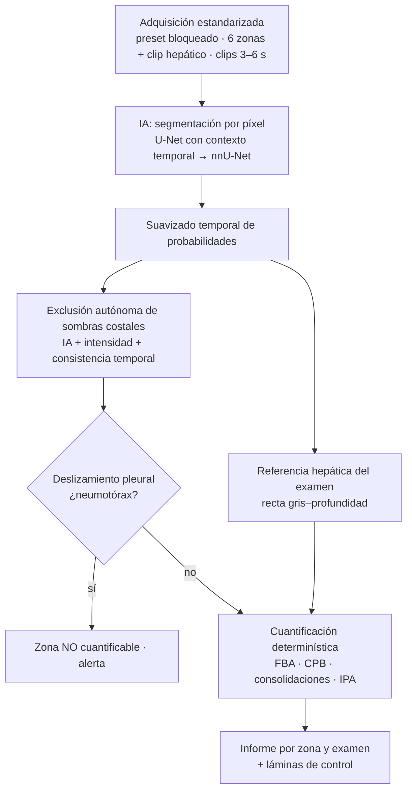

# qLUS-Neo — Propuesta técnica para un LUS score neonatal totalmente cuantitativo

> Documento de diseño, versión 2 (septiembre 2026).
> Objetivo: pasar de un score visual semicuantitativo (0–3 por zona, 0–18 total en el esquema de Brat)
> a una medición continua, reproducible e independiente del observador, de la **pérdida de aireación
> pulmonar** en ecografía pulmonar neonatal.

## 0. Decisiones de diseño de esta versión

1. **Score puramente ecográfico.** El resultado sale solo de la imagen. No hay pesos ajustados con
   datos clínicos (oxigenación, surfactante, etc.): esos datos se usan únicamente para **validar** el
   score, nunca para definirlo.
2. **IA desde el inicio.** Una red neuronal segmenta cada píxel (qué es); una cuantificación
   determinística y auditable calcula el número (cuánto).
3. **Exclusión autónoma de las sombras costales** cuando aparecen en el clip, con tres capas
   independientes (IA, intensidad y consistencia temporal).
4. **Normalización con el hígado del propio paciente**, sin fantoma externo en la rutina.

---

## 1. La premisa física: qué mide realmente el "blanco"

La intuición "más blanco = más líquido, más negro = más aire" es correcta **dentro de un rango**:

- **El blanco mide pérdida de aire, no agua específicamente.** En TTN es mayormente agua; en SDR es
  colapso alveolar; en DBP hay fibrosis. Nombre de la salida: **Índice de Pérdida de Aireación (IPA)**.
- **La relación brillo–aire no es monótona:**

  | Estado | Aire | Imagen | Tratamiento en qLUS-Neo |
  |---|---|---|---|
  | Normal | Alto | Negro con líneas A | Blancura baja |
  | Síndrome intersticial | ↓ | Líneas B separadas | Blancura intermedia |
  | Pulmón blanco | ↓↓ | Líneas B confluentes | Blancura alta |
  | Consolidación / atelectasia | ~0 | Gris tisular | Segmentada: cuenta como tejido sin aire (100 %) |
  | Derrame pleural | — | Negro anecoico | Segmentado: excluido y reportado aparte |
  | Neumotórax | Aire fuera del pulmón | Líneas A sin deslizamiento | Detectado en el video: zona no cuantificable |

- **El brillo depende del equipo y de la configuración.** Por eso preset bloqueado y normalización
  con un tejido de referencia del mismo examen (sección 6).

Conclusión de diseño: **primero clasificar cada píxel (qué es), después medir (cuánto).**

---

## 2. Arquitectura

---

## 3. Adquisición estandarizada

- **Preset "LUS-Neo-Q" bloqueado** en cada equipo: sonda lineal de alta frecuencia (o "hockey stick"
  en prematuros extremos), profundidad fija, foco a nivel pleural, ganancia y TGC fijos, **mapa de
  grises lineal**, **armónicas, compounding, reducción de speckle y persistencia desactivados**,
  sin autooptimización. Registrar el **rango dinámico en dB** del preset.
- **Zonas**: las 6 de Brat como núcleo; opcional protocolo extendido con zonas posteriores.
- **Un clip de referencia hepática por examen** (sección 6), con el mismo preset y sin tocar la
  ganancia.
- **Clips de video de 3–6 s** (el neumotórax solo se detecta en movimiento), en DICOM sin compresión
  con pérdida y sin calipers ni texto sobre la imagen.
- Nombre de archivo: `PACIENTE__zona` (la partición de datos se hace por paciente).

---

## 4. Segmentación con IA

### 4.1 Ontología (una clase por píxel)

| ID | Clase | Uso en el cálculo |
|---|---|---|
| 0 | fondo | excluido |
| 1 | pared torácica | control de ganancia entre clips |
| 2 | costilla | excluye su columna |
| 3 | sombra costal | excluye su columna |
| 4 | línea pleural | define la banda de medición y el deslizamiento |
| 5 | pulmón (con artefactos) | **blancura** |
| 6 | consolidación | **tejido sin aire**; subpleural/extensa por profundidad |
| 7 | derrame | excluido; espesor y área reportados |
| 8 | hígado | **referencia de intensidad** |
| 9 | bazo | excluido |
| 10 | corazón | excluido |
| 11 | timo | excluido (imita consolidación en zonas anteriores superiores) |
| 12 | diafragma | excluido |
| 13 | vaso anecoico | segundo ancla opcional (modo dos puntos) |

Se usa **una sola clase de consolidación**: la distinción subpleural/extensa la hace la cuantificación
por la profundidad medida, así los anotadores no tienen que decidirla y el criterio es explícito.

### 4.2 Modelo y entrenamiento

- **U-Net 2D con contexto temporal**: la entrada son los frames t−1, t y t+1 como tres canales, lo que
  ayuda con la pleura y las líneas B que se mueven. Las probabilidades se **suavizan en el tiempo**
  antes de decidir cada píxel (costillas, sombras e hígado no cambian entre frames).
- **nnU-Net 2D** como modelo de producción: el repositorio exporta el conjunto en su formato, con
  folds agrupados por paciente.
- **Anotación dispersa**: basta anotar 1 de cada n frames; los demás sirven como contexto temporal.
- **Aumentos de datos** que imitan la variabilidad entre equipos: ganancia (desplazamiento aditivo),
  rango dinámico (escala), ruido, volteo y recorte.
- **Preentrenamiento** en dos fuentes, luego ajuste fino con clips neonatales anotados:
  - **autosupervisado con clips reales sin anotar** (la biblioteca existente, sin necesidad de
    hígado): la red reconstruye parches borrados del frame t usando la imagen y los frames vecinos.
    Aprende el aspecto real de pleura, sombras, líneas A/B y consolidaciones antes de ver una
    máscara ([guía](entrenamiento-local.md));
  - **clips sintéticos** (generador incluido, con máscaras exactas), que aportan también las clases
    que aún no tengan anotación real (hígado, vasos).

### 4.3 Métricas de la IA

1. Dice por clase (en validación por paciente).
2. **Sensibilidad por columna de las sombras costales** (una sombra no excluida parece pulmón
   aireado y baja falsamente el IPA).
3. **Métrica principal: concordancia del IPA calculado con las máscaras de la IA frente al IPA
   calculado con las máscaras de expertos** (CCI, Bland–Altman). Si coinciden, la IA reemplaza la
   anotación manual sin cambiar el score.

---

## 5. Exclusión autónoma de las sombras costales

Una columna se excluye del cálculo si cumple cualquiera de estas condiciones:

1. **IA**: la red segmenta costilla en la columna, o más de un 25 % de la columna bajo la pleura es
   sombra.
2. **Red de seguridad por intensidad** (por si la IA no ve la sombra): la línea pleural esperada,
   interpolada desde las columnas vecinas, **no tiene brillo** (< 50 % del brillo pleural mediano) y
   todo lo que está debajo es tanto o más oscuro que el pulmón vecino. El pulmón aireado también es
   oscuro bajo la pleura, pero conserva una pleura brillante; la sombra no.
3. **Consistencia temporal**: con la sonda quieta, una columna sombreada en ≥ 50 % de los frames se
   excluye en todo el clip.

Después se agrega un **margen lateral de 0,5 mm** para eliminar la penumbra. El informe registra
qué fracción se excluyó y por qué vía, y la lámina de control muestra las columnas excluidas
rayadas. Si quedan menos del 30 % de columnas válidas, el frame no se usa. En la vista transversal
intercostal, sin costillas, no se excluye nada.

---

## 6. Normalización con el hígado del paciente

### 6.1 Fundamento

El modo B muestra la amplitud **comprimida en escala logarítmica**. Un cambio de ganancia desplaza
todos los niveles de gris en la misma cantidad, así que la **diferencia de gris entre un píxel
pulmonar y el hígado, convertida a dB, no depende de la ganancia**. Es la misma idea del índice
hepatorrenal para esteatosis, pero en dB y corregida por profundidad.

El hígado es un buen candidato porque es grande, homogéneo, sin aire, está en el mismo examen y se
ve con la misma sonda y el mismo preset. Además, el pulmón consolidado ("hepatización") tiene una
ecogenicidad cercana a la del hígado, lo que da un punto de comparación con sentido físico.

| Referencia | Ventajas | Problemas | Rol |
|---|---|---|---|
| **Hígado** | Grande, homogéneo, accesible en la zona lateral/posterior derecha | Enfermedad hepática lo altera | **Principal** |
| Bazo | Lado izquierdo | Más chico y profundo en neonatos | Alternativa futura |
| Pared torácica | Está en todos los clips | Delgada, campo cercano, varía entre zonas | Solo control de ganancia |
| Corteza renal | — | En neonatos es más ecogénica y variable | No usar |

### 6.2 Protocolo y cálculo

1. En cada examen se adquiere **un clip hepático** (receso costofrénico o zona lateral/posterior
   derecha) con el preset bloqueado.
2. La IA segmenta hígado y vasos; se usa el parénquima con un margen de 1 mm, sin vasos ni bordes.
3. Como el gris cae con la profundidad (atenuación), se ajusta una **recta gris = a + b·profundidad**
   sobre medianas por milímetro (robusta al speckle).
4. Cada píxel pulmonar se compara con el hígado **a su misma profundidad**:
   `r(p) = (gris(p) − gris_hígado(z)) × dB_por_gris`, con `dB_por_gris = rango dinámico / 255`.
5. Blancura 0–1: `e(p) = clip((r − r_aire) / (r_blanco − r_aire), 0, 1)`. Las anclas `r_aire` y
   `r_blanco` (en dB relativos al hígado) se fijan **una sola vez** con los datos de desarrollo
   (pulmón con patrón A y líneas B confluentes, respectivamente) y luego se congelan. Son
   constantes del método, no calibraciones por paciente. Valores provisionales: −20 y +15 dB.

**Modo dos puntos (opcional)**: si además hay un vaso hepático anecoico no recortado a negro, el
contraste hígado–sangre permite recuperar la escala dB/gris cuando el rango dinámico del preset es
desconocido (otro equipo). Limitación: el lumen anecoico mide el piso de ruido del equipo, no una
propiedad del tejido, así que el contraste debe medirse una vez por equipo.

### 6.3 Controles automáticos

- **Píxeles suficientes** de hígado útil; si no hay, el examen no se cuantifica.
- **Saturación** > 2 % de la referencia → advertencia.
- **Heterogeneidad** entre bloques de ~3 mm, tras corregir la profundidad, > 3 dB → advertencia
  (posible lesión focal o vaso no segmentado).
- **Cambio de ganancia entre clips**: si la pared torácica de una zona difiere > 3 dB de la del clip
  hepático → advertencia (la normalización solo vale con el preset bloqueado).
- **Extrapolación**: si la banda pulmonar sale del rango de profundidad cubierto por el hígado.

### 6.4 Limitaciones y validación del hígado como referencia

La ecogenicidad hepática neonatal **no tiene valores normales establecidos** y puede alterarse por
congestión (insuficiencia cardíaca, hidrops), colestasis o enfermedad hepática asociada a nutrición
parenteral, hepatomegalia, enfermedades de depósito, calcificaciones por infección congénita,
hemangiomas o hematomas. Antes del uso clínico hay que medir, **una sola vez y en un estudio de
validación**, cuánto varía la ecogenicidad hepática entre recién nacidos y en el mismo niño día a día
(con un preset fijo y, solo para ese estudio, un fantoma de referencia). Esa variabilidad es el
límite de precisión del IPA. En la rutina no se usa fantoma.

---

## 7. Cuantificación (determinística, puramente ecográfica)

**Banda de medición**: en cada columna válida, desde 0,5 mm bajo la **superficie pulmonar**
(visceral; así un derrame interpuesto no cuenta como pulmón) hasta 15 mm más abajo. La profundidad
fija referida al pulmón hace comparables zonas, pacientes y días.

| Métrica | Definición | Rango |
|---|---|---|
| **FBA** — Fracción de Blanco Aparente | Media de la blancura por columna (percentil 25 vertical) en el pulmón no consolidado | 0–100 |
| **CPB** — Cobertura pleural por patrón B | % de columnas con blancura ≥ 0,5 | 0–100 % |
| **Consolidación subpleural** | % de la banda; componentes con profundidad máxima ≤ 5 mm | % |
| **Consolidación extensa** | % de la banda; componentes > 5 mm, con profundidad y largo reales | % , mm |
| **IPA** — Índice de Pérdida de Aireación | `100 × [c_sub + c_ext + (1 − c_sub − c_ext) × FBA]` | 0–100 |
| Derrame | Espesor máximo (mm) y área (mm²); **no entra al IPA** | — |
| Deslizamiento | Movimiento horizontal bajo la superficie pulmonar menos el de la pared | ~0 en NTX |
| Calidad | Frames válidos, columnas válidas, columnas excluidas por sombra y vía | — |

- **Percentil 25 vertical**: las líneas A tienen huecos negros entre ellas (percentil bajo); las
  líneas B son blancas de arriba a abajo (percentil alto). Así la reverberación horizontal del pulmón
  aireado no se confunde con pérdida de aire.
- **Consolidaciones**: cada píxel consolidado cuenta como 100 % sin aire. La diferencia entre
  subpleural y extensa resulta de su **área y profundidad medidas**, no de pesos asignados.
- **Neumotórax**: sin deslizamiento, con CPB ≤ 5 % y sin consolidación ⇒ **"no cuantificable —
  sospecha de NTX"**, nunca "0 % / normal".
- **Agregación**: mediana de los frames válidos del clip, con P25–P75. **IPA global** = media de las
  zonas cuantificadas; **heterogeneidad** = desviación estándar entre zonas.
- Todos los umbrales (5 mm, 15 mm, P25, 0,5) son parámetros explícitos del método: se fijan antes de
  la validación y se reportan.

---

## 8. Validación (los datos clínicos validan, no definen)

1. **Técnica**: reproducibilidad test–retest entre operadores (CCI, Bland–Altman); estabilidad
   frente a la ganancia; concordancia del IPA con máscaras de IA frente a máscaras de expertos.
2. **Referencia hepática**: variabilidad entre sujetos y día a día (sección 6.4).
3. **Preclínica**: modelos animales pretérmino frente a agua pulmonar gravimétrica, TC y EIT.
4. **Clínica**: validez convergente con S/F, OSI, índice de oxigenación, necesidad de surfactante,
   EIT y evolución. El score **no se reajusta** con estos datos; se informan tal como resultan.
   Reporte según TRIPOD+AI y CLAIM; DECIDE-AI para la fase de impacto clínico.

---

## 9. Hoja de ruta (IA desde el inicio)

| Fase | Contenido | Entregable |
|---|---|---|
| **0. Protocolo y datos** | Preset bloqueado, clip hepático, comité de ética, anonimización, proyecto CVAT con la ontología | Primeros 20–30 pacientes con clips |
| **1. Segmentación IA** | Preentrenamiento autosupervisado (biblioteca sin anotar) y sintético + ajuste fino con anotación dispersa; U-Net y nnU-Net con folds por paciente | Modelo con Dice, sensibilidad de sombras y concordancia de IPA IA vs experto |
| **2. Movimiento** | Sustituir el índice de deslizamiento heurístico por un modelo temporal entrenado (deslizamiento, punto pulmonar, pulso) | Detector de NTX validado |
| **3. Validación** | Fijar anclas y umbrales; test–retest; variabilidad hepática; validez convergente multicéntrica | qLUS-Neo validado |
| **4. Producto** | Inferencia en tiempo real en tablet/PC, informe y tendencias, vía regulatoria | Versión clínica |

---

## 10. Implementación actual (este repositorio)

| Módulo | Contenido |
|---|---|
| `src/qlus/etiquetas.py` | Ontología de 14 clases y colores |
| `src/qlus/io.py` | DICOM (con regiones de ultrasonido y tamaño de píxel), video y `.npz` |
| `src/qlus/sintetico.py` | Generador de clips sintéticos con máscaras exactas |
| `src/qlus/modelos.py` | U-Net 2D con contexto temporal |
| `src/qlus/biblioteca.py` · `preentrenamiento.py` | Ingesta anonimizada de clips sin anotar y preentrenamiento autosupervisado |
| `src/qlus/entrenamiento.py` · `inferencia.py` | Entrenamiento (partición por paciente, anotación dispersa) e inferencia con suavizado temporal |
| `src/qlus/postproceso.py` | Línea pleural y exclusión autónoma de sombras costales |
| `src/qlus/normalizacion.py` | Referencia hepática (uno y dos puntos) |
| `src/qlus/cuantificacion.py` | FBA, CPB, consolidaciones, derrame, deslizamiento, IPA |
| `src/qlus/anotacion.py` · `nnunet.py` | Importación de máscaras (CVAT, etc.) y exportación a nnU-Net v2 |

Ver el `README.md` para los comandos.

---

## 11. Riesgos y trampas conocidas

- **Saturación**: si la ganancia satura el pulmón blanco, el índice tiene techo.
- **Timo** confundido con consolidación; **corazón** en zona anterior inferior izquierda.
- **Presión y ángulo** de la sonda: frames oblicuos deben descartarse.
- **Cambio de ganancia entre clips**: rompe la normalización; se advierte automáticamente.
- **Hígado anormal**: la referencia pierde validez; se advierte por heterogeneidad, pero no detecta
  cambios difusos. Registrar la patología hepática conocida.
- **Cambio de dominio** entre equipos: validación externa obligatoria.
- **Sintético ≠ real**: el generador sirve para probar la tubería y preentrenar, no para validar.

---

## Referencias

1. Brat R, Yousef N, Klifa R, et al. Lung Ultrasonography Score to Evaluate Oxygenation and
   Surfactant Need in Neonates Treated With CPAP. *JAMA Pediatr.* 2015.
   <https://pubmed.ncbi.nlm.nih.gov/26237465/>
2. Raimondi F, Migliaro F, Verdoliva L, et al. Visual assessment versus computer-assisted gray scale
   analysis in the ultrasound evaluation of neonatal respiratory status. *PLoS One.* 2018;13:e0202397.
   <https://journals.plos.org/plosone/article?id=10.1371%2Fjournal.pone.0202397>
3. Sett A, et al. Quantitative lung ultrasound detects dynamic changes in lung recruitment in the
   preterm lamb. *Pediatr Res.* 2022. <https://pmc.ncbi.nlm.nih.gov/articles/PMC10172106/>
4. Computer-assisted analysis of pleural and subpleural lung ultrasound correlates with oxygenation
   in preterm infants. *Sci Rep.* 2026. <https://pubmed.ncbi.nlm.nih.gov/41748659/>
5. Corradi F, Brusasco C, Vezzani A, et al. Computer-Aided Quantitative Ultrasonography for Detection
   of Pulmonary Edema in Mechanically Ventilated Cardiac Surgery Patients. *Chest.* 2016;150:640-51.
6. Brusasco C, Santori G, Bruzzo E, et al. Quantitative lung ultrasonography: a putative new algorithm
   for automatic detection and quantification of B-lines. *Crit Care.* 2019.
   <https://pubmed.ncbi.nlm.nih.gov/31455421/>
7. Mento F, Demi L. On the influence of imaging parameters on lung ultrasound B-line artifacts,
   in vitro study. *J Acoust Soc Am.* 2020;148:975-83.
8. Impact of ultrasound settings on lung vertical artefacts: an observational study in mechanically
   ventilated patients. *ERJ Open Res.* 2025.
   <https://publications.ersnet.org/content/erjor/11/1/00483-2024>
9. Ultrasound Lung Aeration Map via Physics-Aware Neural Operators (Luna). 2025.
   <https://arxiv.org/abs/2501.01157>
10. Deep learning approaches for automated classification of neonatal lung ultrasound with assessment
    of human-to-AI interrater agreement. *Comput Biol Med.* 2024;183:109315.
    <https://pubmed.ncbi.nlm.nih.gov/39504781/>
11. Lung ultrasound video scoring using a novel motion-aware segmentation technique: Toward automated
    neonatal LUS scoring. *Comput Biol Med.* 2025. <https://pubmed.ncbi.nlm.nih.gov/41135419/>
12. An Interpretable Neonatal Lung Ultrasound Feature Extraction and Lung Sliding Detection System
    Using Object Detectors. <https://pmc.ncbi.nlm.nih.gov/articles/PMC10712663/>
13. ESICM–ESPNIC international expert consensus on quantitative lung ultrasound in intensive care.
    *Intensive Care Med.* 2025;51:1022-49. <https://pubmed.ncbi.nlm.nih.gov/40353867/>
14. Oulego-Erroz I, Blanco P. Consensus on quantitative lung ultrasound: are experts moving ahead of
    evidence? *Intensive Care Med.* 2025. <https://pubmed.ncbi.nlm.nih.gov/40658242/>
15. Characteristics of scores used for quantitative lung ultrasound in neonates: a systematic review.
    <https://pmc.ncbi.nlm.nih.gov/articles/PMC12000906/>
16. Isensee F, Jaeger PF, Kohl SAA, et al. nnU-Net: a self-configuring method for deep learning-based
    biomedical image segmentation. *Nat Methods.* 2021;18:203-11.

> Nota: las referencias 4, 8 y 11 se verificaron por título, revista y año; antes de citarlas en un
> manuscrito conviene completar autores y paginación desde el texto completo.
